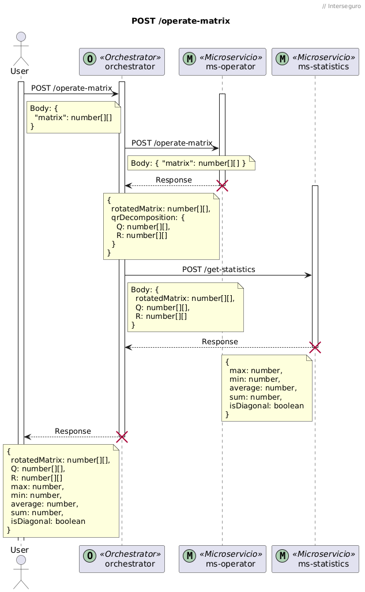
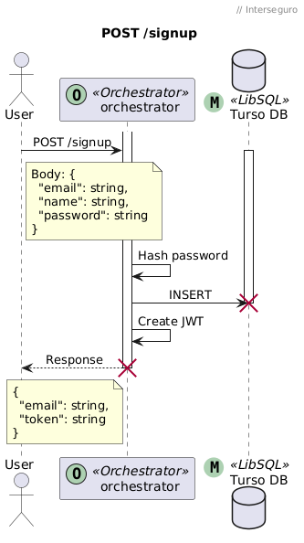
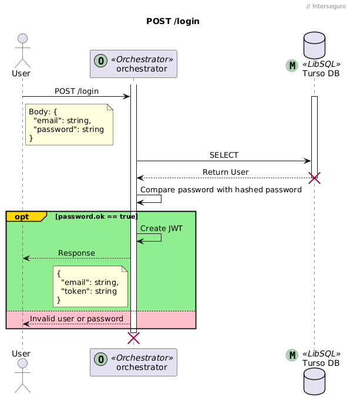

# Interseguro - Prueba Técnica

## Levantar los servicios

### Variables de entorno

**ms-operator:**

```bash
PORT=
```

**ms-statistics:**

```bash
PORT=
```

**orchestrator:**

```bash
PORT=

LIBSQL_DB_URI=
LIBSQL_DB_TOKEN=

MS_OPERATOR_URL=
MS_STATISTICS_URL=

JWT_SECRET=
```

### Usar versión de node

```bash
nvm use
```

### Instalar dependencias

```bash
pnpm install --frozen-lockfile
```

### Correr en desarrollo

```bash
pnpm dev
```

### Build al repositorio

```bash
pnpm build
```

### Correr en producción

```bash
pnpm start
```

### Correr test

```bash
pnpm test
```

## Arquitectura

Se usó una Arquitectura Hexagonal.

<center>
 
</center>

En esta arquitectura se busca separar la aplicación en 3 capas:

- **Domain**: Contiene los modelos y las interfaces de la aplicación. Solo se puede comunicar con la misma capa.
- **Application**: Contiene la lógica de negocio y los _dto_ (_Data Transfer Object_). Se comunica con la capa de dominio y la misma capa.
- **Infrastructure**: Contiene la implementación de las interfaces de la capa de dominio, los controladores y las inyecciones de dependencia; esta capa puede tener contacto con el exterior mediante internet. Se comunica con la capa de dominio, aplicación y la misma capa.

## Endpoints

### Operar matriz

> POST `/operate-matrix`

**Headers:**

```json
{
  "authorization": "Bearer <token>"
}
```

**Request:**

```json
{
  "matrix": number[][]
}
```

**Response:**

```json
{
  "rotatedMatrix": number[][],
  "Q": number[][],
  "R": number[][],
  "max": number,
  "min": number,
  "average": number,
  "sum": number,
  "isDiagonal": boolean
}
```

**Diagrama de flujo:**

<center>
 
</center>

### Signup

> POST `/signup`

**Request:**

```json
{
  "email": "string",
  "name": "string",
  "password": "string"
}
```

**Response:**

```json
{
  "email": "string",
  "token": "string"
}
```

**Diagrama de flujo:**

<center>
 
</center>

### Login

> POST `/login`

**Request:**

```json
{
  "email": "string",
  "password": "string"
}
```

**Response:**

```json
{
  "email": "string",
  "token": "string
}
```

**Diagrama de flujo:**

<center>
 
</center>
